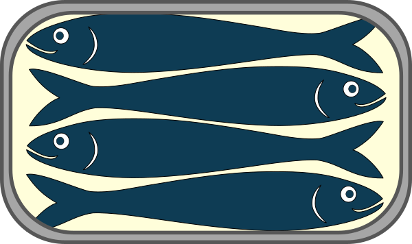
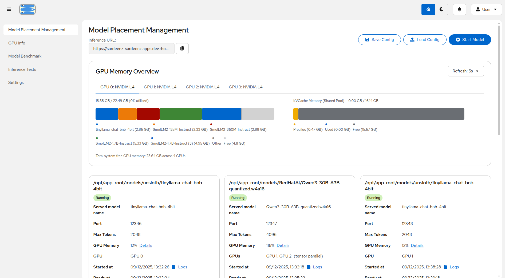
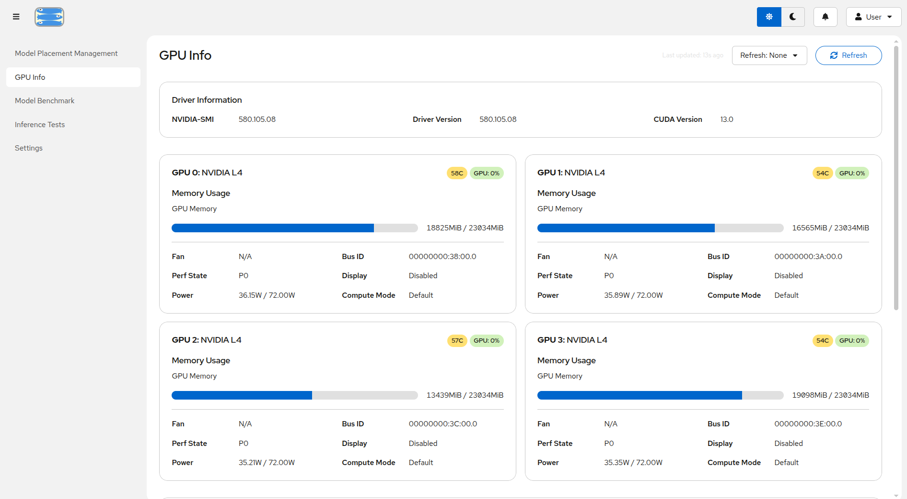
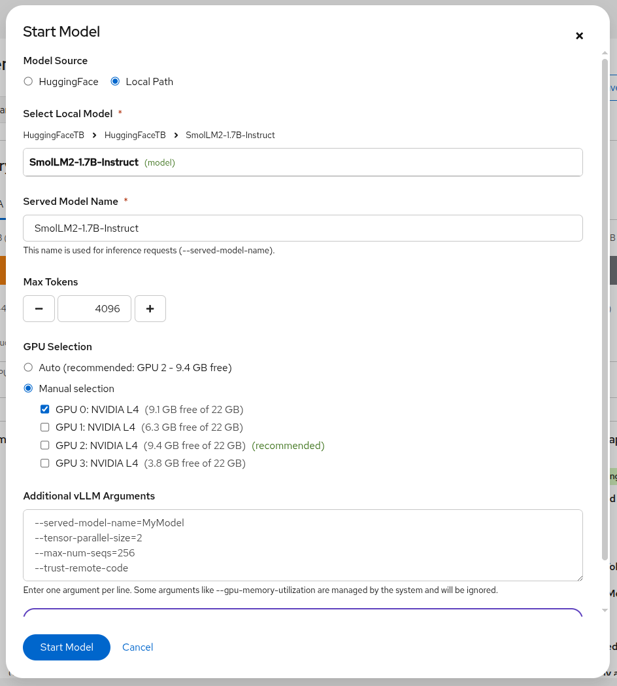
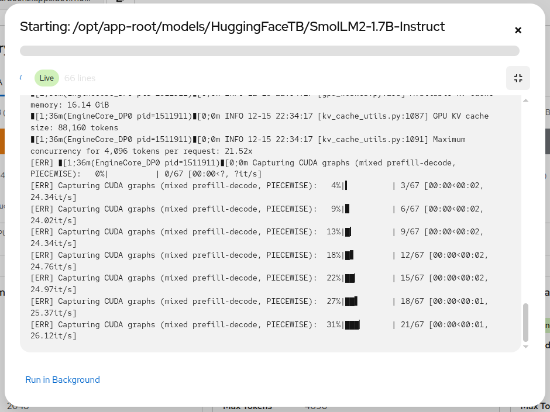

<p align="center">
  
</p>

# Sardeenz

Sardeenz is a proof-of-concept application that allows you to load more than one model on a given GPU. It allows you to add more and more models onto the GPU, until it is fully utilized. You can also do this for a set of GPUs on the same machine or visible by the same Pod in a Kubernetes environment.

> **Status:** Early development (PoC phase)

## What is Sardeenz?

Sardeenz is a multi-model management application that enables dynamic loading and serving of multiple Large Language Models (LLMs) through a unified interface. Built on top of **[vLLM](https://github.com/vllm-project/vllm)** and **[kvcached](https://github.com/ovg-project/kvcached)**, it provides efficient multi-model hosting with intelligent GPU resource management.

**Why "Sardeenz"?** We were looking for a way to cram more models onto a GPU. "[Packed like sardines](https://wordhistories.net/2024/06/22/packed-like-sardines/)" captures the idea perfectly. Pronounced like [sardines](https://www.youtube.com/watch?v=Rr1dwxmeIOU).

## Quick Start

Pre-built container images are available at `quay.io/rh-aiservices-bu/sardeenz`.

**Run locally with Docker:**

```bash
podman run --gpus all -p 3000:3000 quay.io/rh-aiservices-bu/sardeenz:latest
```

**Deploy on OpenShift/Kubernetes:** See [deployment/](./deployment/) for manifests and configuration.

See the [Deployment Guide](./docs/deployment.md) for full configuration options, authentication setup, and production deployment.

## Features

- **Dynamic model loading** - Load and unload models on the fly without downtime from local storage or HuggingFace
- **Multi-GPU support** - Distribute models across GPUs with tensor parallelism
- **OpenAI-compatible API** - Single endpoint drop-in replacement for all served models
- **Web dashboard** - Manage models, monitor GPU memory, run benchmarks
- **Memory sharing** - kvcached integration for efficient GPU utilization

## Screenshots

### Model Management Dashboard



### GPU Memory Visualization



### Model Configuration/Loading



### Model Loading Progress



## Documentation

|                                                       |                                    |
| ----------------------------------------------------- | ---------------------------------- |
| **[Full Documentation](./docs/README.md)**            | Complete documentation index       |
| **[Deployment Guide](./docs/deployment.md)**          | Container and OpenShift deployment |
| **[Development Guide](./docs/development/README.md)** | Build from source, contribute      |
| **[API Guide](./docs/api-guide.md)**                  | API reference with code examples   |
| **[Architecture](./docs/architecture.md)**            | System design and components       |

## License

Apache-2.0
